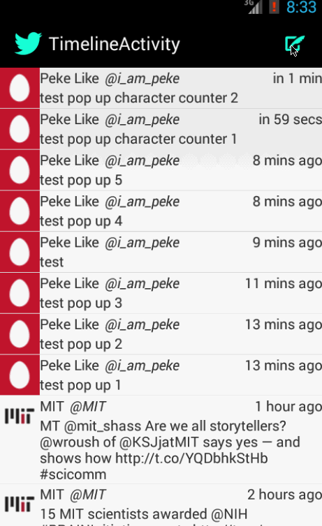

CodePathAndroidBootcampW3
=========================

Simple Twitter Client

This is an Android application for the Simple Twitter Client using the Twitter API, the android-async-http library and the RestClientTemplate.

**Time spent:**

**Completed user stories in base project (SimpleTwitterClient):**

- [x] User can sign into Twitter using OAuth login
- [x] User can view the tweets from their home timeline:
    - User is displayed the profile picture, username, name and body for each tweet
    - User is displayed the relative timestamp for each tweet
    - User can view more tweets as they scroll with infinte pagination (using page param)
- [x] User can compose a new tweet:
    - User can click a "Compose" icon in the Action Bar on the top right
    - User can then enter a new tweet and hit the Tweet button in the Action Bar on the top right; the user's tweet will be posted to Twitter.
    - User is then taken back to their home timeline where the new tweet shows up in their timeline!
- [x] A color theme for the Action Bar and App/Twitter logos was developed.

**Walkthrough of base user story (SimpleTwitterClient):**

**Modifications to base user stories (SimpleTwitterClientPopUpAndCounter):**

- [x] When user creates a new tweet, now instead of changing screens a tweet entry dialog pops up.
    - The user can see how many characters they have left to type until they hit Twitter's 140 character limit for a tweet.
    - The dialog will not allow the user to enter any more than 140 characters into the text entry field

**Walkthrough of new features added to base user story (SimpleTwitterClientPopUpAndCounter):**

GIFs created with [LiceCap](http://www.cockos.com/licecap/).

